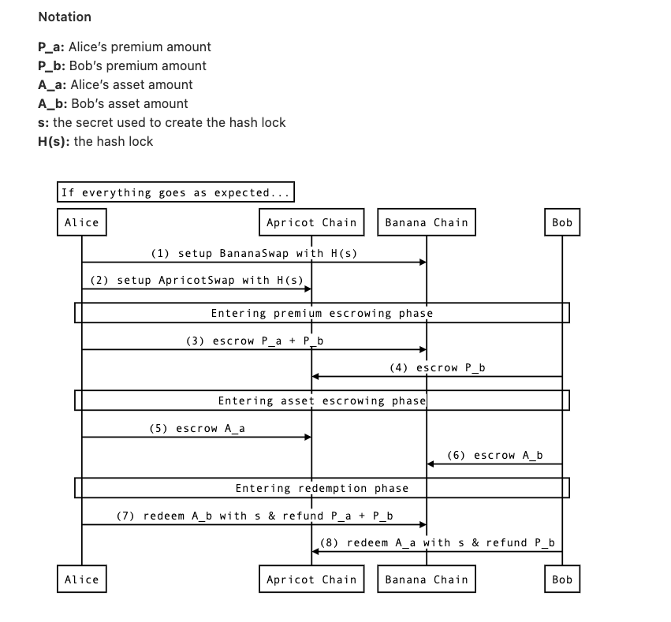

# Swap

## Concepts

1. **Escrowing:** In standard finance, escrow accounts are owned by third parties to hold assets until some condition is fulfilled. In blockchain finance, those third parties are smart contracts. Putting those together, escrowing an asset on a blockchain means transferring custody to a smart contract until some condition is fulfilled.

2. **Cross-Chain Commerce:** Cross-chain commerce allows us to make financial exchanges across multiple blockchains that cannot communicate with each other. For example, we could have cross-chain commerce by using the incompatible Bitcoin and Ethereum chains (although any such implementation wouldn’t be feature-rich, as Bitcoin lacks smart contracts).

3. **Hashlocks:** Hashlocks are the backbone of many smart contracts. I’m free to publish H(S) as far and wide as I like, since nobody will be able to reverse-engineer S. The fulfillment condition for releasing an escrowed asset is providing S, which the contract can quickly verify hashes to H(S).

## Two party swap - The Protocol

In this example, Alice sets up a cross-chain swap with Bob. She owns Apricots and he owns Bananas. She wants to trade some of her Apricots for some of his Bananas.

Some of the communication between Alice and Bob must happen off chain, such as Alice telling Bob the hashLock for the swaps. For simplicity’s sake, the protocol only depicts on-chain communication, which is the part that you will be implementing.



## Steps Explained

1. Alice must first set up the swap contracts. She will create a BananaSwap on the BananaChain and an ApricotSwap on the ApricotChain. Both will have the same hashLock `H(S)`, but only Alice knows the secret `S`.

   Note: A participant in this protocol escrows their premium on the chain of the asset they’d like to receive. That means that Alice and Bob must each own both assets. In this case, that means they both must own some Apricot and some Banana.

2. As the initiator, Alice has to escrow an amount equal to her premium + Bob’s premium on the BananaChain. This might surprise you, as we’d expect her to only have to pay the amount totalling her premium. The reason for this is covered in Section 5.2 of the original paper.

3. Having seen Alice successfully escrow her premium on the BananaChain, Bob now escrows his premium on the ApricotChain.

4. Now that both parties have escrowed their premiums, we enter the asset escrowing phase. If either party disappears at this point, they’ll lose their premium! Alice escrows her Apricots on the ApricotChain.

5. Having seen Alice correctly escrow her Apricots, Bob follows suit by escrowing his Bananas on the BananaChain.

6. Alice sees that Bob’s bananas are correctly escrowed, so now she gets to redeem them! Doing so requires her to reveal the secret `S`. She should also get her premium refunded, since she followed the specifications of the protocol.

7. Since Alice had to reveal `S` to collect her Bananas, Bob now knows the secret! Using `S`, he can collect his Apricots and have his premium P_b refunded.

## Implemented Functions

```javascript
/**
setup is called to initialize an instance of a swap in this contract.
Due to storage constraints, the various parts of the swap are spread
out between the three different mappings above: swaps, assets,
and premiums.
*/
function setup(
  uint expectedAssetEscrow,
  uint expectedPremiumEscrow,
  address payable assetEscrower,
  address payable premiumEscrower,
  address assetName,
  bytes32 hashLock,
  uint startTime,
  bool firstAssetEscrow,
  uint delta
)
  public
  payable
  canSetup(hashLock)
{}
```

**Overview**

This function instantiates an instance of a swap (for one side of the protocol).

- prevent initiating duplicate swap by setting certain requirements. (hint: you can use zero address as “null”)
- instantiate the appropriate structs based on the arguments and then add those structs to their mappings.
- That depends on whether that chain has the first asset escrow. The `delta` argument is an agreed-upon safe time interval for both parties, such that each interval is some `n * delta`, beginning from the `startTime`.
- In the first protocol sequence above, `firstAssetEscrow` is true on the ApricotChain and false on the BananaChain (since in the asset escrowing round the Apricots are escrowed prior to the Bananas). Thus, the deadline for the premium on the BananaChain (where `firstAssetEscrow` is false) is `startTime + 1 * delta`.
- The timeout for the swap is a time after which all possible events have occurred on a chain.

```javascript
/**
The premium escrower has to escrow their premium for
the protocol to succeed.
*/
function escrowPremium(bytes32 hashLock)
  public
  payable
  canEscrowPremium(hashLock)
{}
```

```javascript
/**
The asset escrower has to escrow their premium for
the protocol to succeed.
*/
function escrowAsset(bytes32 hashLock)
  public
  payable
  canEscrowAsset(hashLock)
{}
```

```javascript
/**
redeemAsset redeems the asset for the new owner.
*/
function redeemAsset(bytes32 preimage, bytes32 hashLock)
  public
  canRedeemAsset(preimage, hashLock)
{}
```

```javascript
/**
refundPremium refunds the premiumEscrower's premium
should the counterparty break from the protocol
*/
function refundPremium(bytes32 hashLock)
  public
  canRefundPremium(hashLock)
{}
```

```javascript
/**
refundAsset refunds the asset to its original owner
should the swap fail
*/
function refundAsset(bytes32 hashLock)
  public
  canRefundAsset(hashLock)
{}
```

```javascript
/**
redeemPremium allows a party to redeem the
counterparty's premium should the swap fail
*/
function redeemPremium(bytes32 hashLock)
    public
    canRedeemPremium(hashLock)
{}
```

## Commands for hardhat test and compilation:

To test the implementation, run `npx hardhat test`

- This will both compile AND test

If you just want to compile, run `npx hardhat compile`

### All hardhat commands:

```
npx hardhat accounts
npx hardhat compile
npx hardhat clean
npx hardhat test
npx hardhat node
node scripts/sample-script.js
npx hardhat help
```
